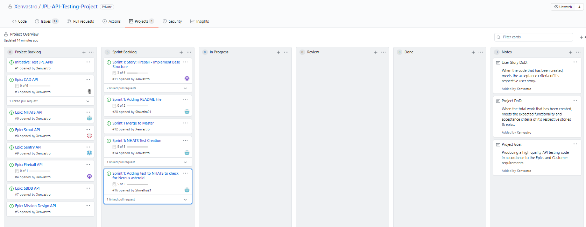

# C# SDET API Test Framework Project

## JPL API Testing

### Project Goal
* Producing a high quality API testing code in accordance to the Epics and Customer requirements.

### Definition of Done
* When the total work that has been created, meets the expected functionality and acceptance criteria of 
it's respective stories & epics.

#### Sprint 1
#### Goal: To create Service Object Model for the API and Write atleast one Unit test for each API present.

* To create Service Object Model
* Create seperate folder to interact with different API

#### Screenshot of project Board Before and after Sprint 1

##### Before Sprint 1
