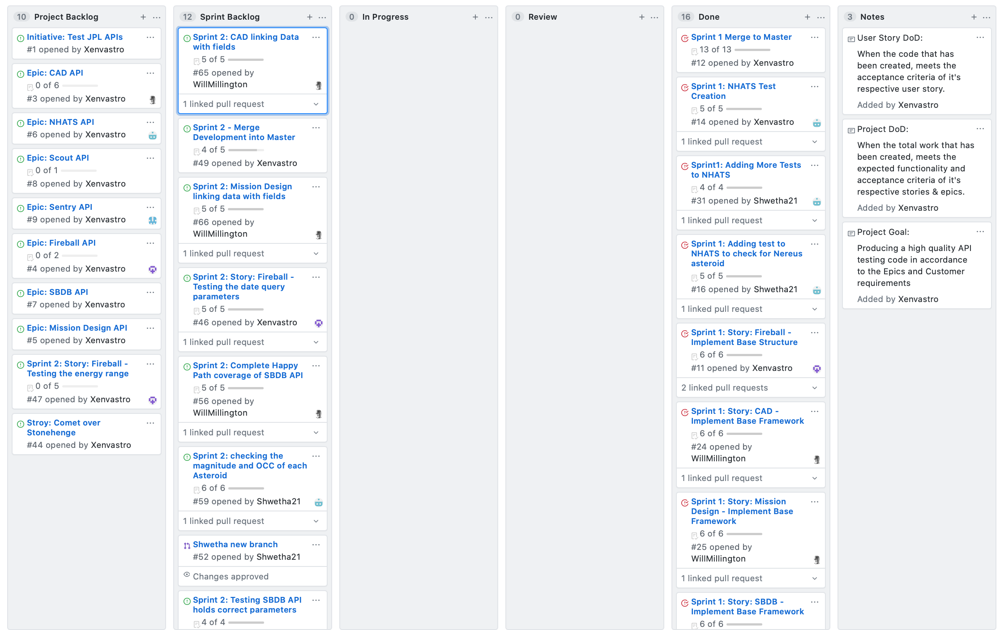

# C# SDET API Test Framework Project

## JPL API Testing

### Project Goal
* Producing a high quality API testing code in accordance to the Epics and Customer requirements.

### Definition of Done
* When the total work that has been created, meets the expected functionality and acceptance criteria of 
it's respective stories & epics.

#### Sprint 1
#### Goal: To create Service Object Model for the API and Write atleast one Unit test for each API present.

* To create Service Object Model
* Create seperate folder to interact with different API

#### Sprint 1 - Review

- List of backlog items that have been completed
- List of backlog items that haven't been completed
- Focusing on the apis that have more data to the them
- Potentially keeping mind of what the application could look like when there are more solutions rather than just the one
- Look towards testing the different data that comes back from the apis more explicitly
- Go into detailed tests on a request if it consists of one specific object

#### Sprint 1 - Retrospective

##### Start
- Increase level of communication
- Do more research on the APIs

##### Stop

#### Continue
- Smaller commits
- Keeping everyone informed
- Working independently

#### Action Points

#### Screenshot of project Board Before and after Sprint 1

##### Before Sprint 1

##### After Sprint 1

#### Sprint 2
#### Goal: To create unit tests to cover many aspects of 'happy path' for the APIs present.

* To determine the main aspecs of the API and test them accordingly
* Continue to work within individual APIs to avoid conflict and error in code

#### Sprint 2 - Review

- Sprint Backlog items have been completed
- None hae been pushed back into project backlog
- Focussed on the api's happy path
- Potentially keeping mind of what the application could look like when there are more solutions rather than just the one
- Look towards testing the different data that comes back from the apis bad path
#### Sprint 2 - Retrospective

##### Start
- Ensure User stories are added before the work is started

##### Stop
- Leaving the backlog empty

##### Continue
- Keep everyone informed
- Updated local branches before work
- ##### Before Sprint 2

##### After Sprint 2
